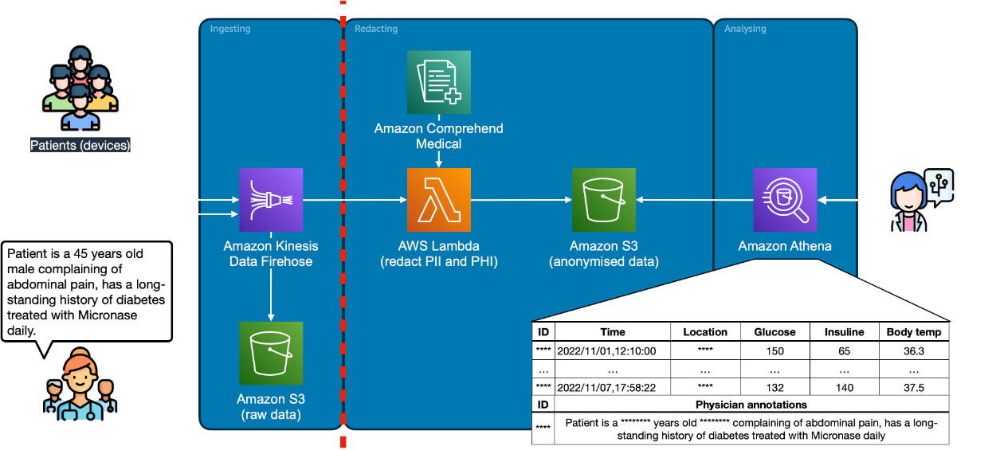

# Introduction

This solution illustrates how to implement privacy requirements for medical records 
with a near real-time identification and redaction of PII and PHI in data stream using
natural language processing (NLP) techniques. 

Data generated by monitoring devices and human annotations is processed in transit 
for privacy-sensitive content using Amazon Comprehend Medical. If detected, PII and 
PHI data are redacted and the data is delivered in a Data Lake for further processing. 

# Workflow description

1. Patients enrolled in the study carry continuous monitors for glucose and insulin concentration in the blood stream, location, and body temperature
2. General physicians routinely evaluate patients conditions. Annotations are recorded on patients’ files
3. Data is ingested, PII and PHI are identified and redacted
4. Data scientists access the anonymised records for further investigations

# Diagram

# Implementation details

The solution is designed to be distributed as a mono-repository containing all the 
components (both software and infrastructure).

## Prerequisites

1. S3 bucket to store the terraform state file
2. DynamoDB table to lock the terraform state file

https://developer.hashicorp.com/terraform/language/settings/backends/s3

## How to deploy it

Before executing the commands below, change the references in the file 
`src/terraform/_variables.tf` and 
`src/terraform/_backend.tf` to match your account configuration. 

        tfenv use 1.2.8
        cd src/terraform
        terrafom init
        terraform apply

## Note

All the data included in this repository has been synthetically generated.
